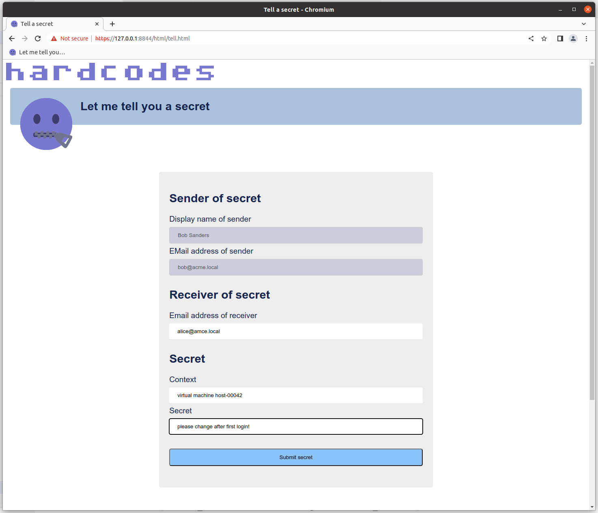

# lmtyas - Let me tell you a secret

A web service written in Rust that allows an authenticated user to send secrets like passwords to other authenticated users.

In a perfect world we wouldn't need passwords anymore but more often than not we also still do need to tell them to other people. There is a world almost without passwords out there, e.g. have a look at [SQRL](https://www.grc.com/sqrl/sqrl.htm) or [fido2](https://en.wikipedia.org/wiki/FIDO2_Project). 

Sending passwords by email is unsecure because most people are not able to receive encrypted emails. Sending passwords by snail mail is slow. Using a second channel, e.g. like a chat program, may work but often leaves traces or involves third parties you do not trust. Telling the via phone is next to impossible.

*"Let me tell you a secret" enters the stage*

Simply enter a

- secret (like a password)
- context (a hint what the secret is for) and
- an email address of the receiver

on the website driven by this web service and the receiver will get an email with a link that entitles to read the secret. The secret id and thus the receiver is encoded in the link and since authentication is needed to open the secret, we make sure that only the right person reads the secret.



Yes, identities can be stolen and/or hacked - but then you have got bigger problems at hand. Again, have a good look at [SQRL](https://www.grc.com/sqrl/sqrl.htm) or [fido2](https://en.wikipedia.org/wiki/FIDO2_Project).

**NOTE**: secrets like passwords should be forced to be changed after first login!


# Configuration file

See [lmtyas-config.json](conf.dev/lmtyas-config.json) for an example configuration binding to `127.0.0.1:8844`.

| config item                      | config data                                                                                               |
|----------------------------------|-----------------------------------------------------------------------------------------------------------|
| {                                | ==> begin of root object                                                                                  |
| "web_bind_address"               | ip address and port to bind to, e.g. `"127.0.0.1:8844"`                                                   |
| "ssl_private_key_file"           | path/filename of the SSL private key, e.g. `"/etc/lmtyas/lmtyas-selfsigned.key"`                          |
| "ssl_certificate_chain_file"     | path/filename of the SSL certificate chain, e.g. `"/etc/lmtyas/lmtyas-selfsigned-cert.pem"`               |
| "rsa_private_key_file"           | path/filename of the RSA private key file, e.g. `"/etc/lmtyas/lmtyas_rsa_private.key"`                    |
| "rsa_public_key_file"            | path/filename of the RSA public key file, e.g. `"ignore/lmtyas_rsa_public.key"`                           |
| "secret_directory"               | path to store the secret files, e.g. `"output/secrets"`                                                   |
| "email_configuration" : {        | ==> object with email configuration details                                                               |
|     "mail_server_address"        | name or ip address of mail server, e.g.`"127.0.0.1"`                                                      |
|     "mail_server_port"           | port number of mail server, e.g. `2525`                                                                   |
|     "mail_from"                  | mail address that sends secrets, e.g. `"IT-department <do-not-reply@acme.local>"`                         |
|     "mail_subject"               | subject used in mails, e.g. `"Your new password for {Context}"`                                           |
|     "mail_template_file"         | path/filename of mail template, e.g. `"etc/lmtas/mailtemplate.txt"`                                       |
| },                               | <== end of object with email configuration details                                                        |
| "admin_accounts"                 | array with valid admin accounts to set password, e.g. `["walter"]`                                        |
| "max_authrequest_age_seconds"    | time in seconds an authentiction attempt is valid, e.g. `300`                                             |
| "max_cookie_age_seconds"         | time in seconds an account is still logged in, e.g. `90` (forms keep accounts alive)                      |
| "fqdn"                           | fqdn to use in redirects, e,g, `"my-server.local:8844"`                                                   |
| "ldap_common_configuration": {   | ==> object with common ldap configuration                                                                 |
|     "url"                        | url to connect to ldap server, e.g. `"ldap://127.0.0.1:3893"`                                             |
|     "base_ou"                    | ou where user accounts are stored, e.g. `"ou=superheros,dc=acme,dc=local"`                                |
|     "bind_passwd"                | password to bind to the ldap server, e.g. `"ldapsecr3t"`                                                  |
|     "bind_dn"                    | dn of user that is allowed to query the ldap, e.g. `"cn=ldap-tec-user,ou=svcaccts,dc=acme,dc=local"`      |
|     "user_filter"                | filter to used to query accounts, `{0}` is replaced with login name, e.g. `"(uid={0})"`                   |
|     "mail_filter"                | filter to used to query accounts, `{0}` is replaced with mail address, e.g. `"(mail={0})"`                |
|     "authentication:": {         | object with optional ldap authentication configuration                                                    |
|     "ldap_bind_user_dn"          | dn of users logging in, `{0}` is replaced with login name, e.g. `"cn={0},ou=superheros,dc=acme,dc=local"` |
|     "valid_user_regex"           | regex of valid user names, e.g. `"^[\\w\\d\\-]{3,8}"`                                                     |
|     },                           | <== end of object with ldap authentication configuration                                                  |
| },                               | <== end of object with common ldap configuration                                                          |
| "oidc_configuration": {          | ==> object with optional oidc configuration                                                               |
|     "provider_metadata_url":     | base url which serves `.well-known/openid-configuration`, e.g. `"https://acme.eu.auth0.com/"`             | 
|     "client_id":                 | oidc client id of this application, e.g. `"Y2xpZW50X2lk"`                                                 |
|     "client_secret":             | oidc client secret of this application, e.g. `"Y2xpZW50X3NlY3JldA=="`                                     |
|     "valid_user_regex":          | regex of valid user names (email), e.g. `"^[\\w\\d\\-]{3,8}@acme\\.local$"`                               |
| },                               | <== end object with optional oidc configuration                                                           |
| "login_hint"                     | hint for users which account to use for login, e.g. `"A.C.M.E. LDAP account"`                             |
| "mail_hint"                      | optional hint what mail address format should be used, e.g. `givenname.surname@acme.local`                |
| "imprint": {                     | ==> object with imprint link data                                                                         |
| "href"                           | link to an imprint page, e.g. `"https://www.acme.local"`                                                  |
| "target"                         | target window for imprint, one out of `"_self"`, `"_blank"`, `"_parent"`, `"_top"`                        |
| }                                | <== end of with imprint link data                                                                         |
| }                                | <== end of root object                                                                                    |

- **NOTE  1**
    - "mail_subject": `{Context}` is replaced with the context entered in the web form.
    - "mail_template_file":
        - `{ToDisplayName}` is replaced with the display name of the receiver,
        - `{FromDisplayName}` is replaced with the display name of the sender,
        - `{Context}` is replaced with the context entered in the web form.
        - `{UrlPayload}` is replaced with the encrypted secret id to access the secret.
     
        URL must be in the template, see [mailtemplate.txt](./conf.dev/mailtemplate.txt).

        Depending on your authentication backends you may not know the data for each of the placeholders!
- **NOTE 2** The objects `email_configuration`, `ldap_configuration` and `oidc_configuration` may be absent or differ, depending on the selected features. See section *[Compile and install -features](#compile-and-install---features)*.
- **NOTE 3** The directive `mail_hint` may be absent. If so the default `firstname.lastname@acme.local` will be used.

You need a SSL certificate and its unencrypted key in pem format. Create your own *[set of rsa keys](#security---data-encryption---rsa-keys)*.


# External dependencies

An installed `openssl` library is needed on the server side, the header files are needed on your development machine.


# Compile and install

Compiling probably works on any system that has a Rust compiler and recent OpenSSL packages including header files available.

Here is an example that works for Ubutu 20.04 LTS , Ubuntu 22.04 LTS and CentOS7. Probably any recent Linux distro with Systemd will work. Every distro without Systemd will probably also work with some modifications for the startup process.

Head over to [www.rust-lang.org](https://www.rust-lang.org/tools/install) and follow the instructions if you don't have a Rust compiler installed yet.

```bash
# done as regular user
sudo apt update
sudo apt upgrade
# install the only dependency:
sudo apt install openssl
sudo apt install libssl-dev # only needed on dev machine
# clone and compile the code
git clone git@github.com:hardcodes/lmtyas.git
cd lmtyas
cargo build --release
# create user for running the service
groupadd lmtyas
sudo adduser --disabled-login --home /opt/lmtyas --no-create-home --system  --shell /usr/sbin/nologin --ingroup lmtyas lmtyas
# create directory structure
sudo mkdir -p /opt/lmtyas/web-content
sudo mkdir -p /opt/lmtyas/output/secrets

# create systemd unit file
sudo cat << __EOF__ > /etc/systemd/system/lmtyas.service
[Unit]
Description=[lmtyas.service] let me tell you a secret service
After=network.target
Wants=basic.target

[Install]
WantedBy=multi-user.target

[Service]
EnvironmentFile=-/etc/lmtyas/lmtyas-systemd.conf
Type=simple
Restart=always
User=lmtyas
Group=lmtyas
WorkingDirectory=/opt/lmtyas
ExecStart=/opt/lmtyas/lmtyassvc --config-file \${lmtyasCFGFILE}
__EOF__

# create systemd environment file
sudo mkdir /etc/lmtays
sudo cat << __EOF__ > /etc/lmtyas/lmtyas-systemd.conf
lmtyasCFGFILE="/etc/lmtyas/lmtyas-config.json"
__EOF__
sudo chown root:lmtyas /etc/lmtyas/lmtyas-systemd.conf
sudo chmod 640 /etc/lmtyas/lmtyas-systemd.conf

# enable service
sudo systemctl daemon-reload
sudo systemctl enable lmtyas.service
sudo systemctl unmask lmtyas.service
# copy binary
sudo cp target/release/lmtyas /opt/lmtyas/
# copy files
sudo cp --recursive web-content/* /opt/l3umw/web-content/

# fix owner and acl
sudo chown -R lmtyas:lmtyas /opt/lmtyas/
sudo find /opt/lmtyas/ -type f -exec chmod 640 {} \;
sudo find /opt/lmtyas/ -type d -exec chmod 750 {} \;
sudo chmod 750 /opt/lmtyas/lmtyas
```

Create a [`/etc/lmtyas/lmtyas-config.json`](#configuration-file), the *[rsa keys](#security---data-encryption---rsa-keys)* and get a ssl certficate in PEM format --- this may be self signed, depending on your own personal needs; in a company context you probably want a signed certifcate from some sort of CA/PKI. Then

```bash
sudo find /etc/lmtyas/ -type f -exec chmod 640 {} \;
chown lmtyas:lmtyas /etc/lmtyas/lmtyas-config.json
sudo systemctl start lmtyas.service
```


## Compile and install - features

Also see [Cargo.toml](./Cargo.toml), section `[features]`.

- Default: **oidc-auth-ldap**, **mail-noauth-notls** (users are authenticated with an external oidc server: Authorization Code Flow with Proof Key for Code Exchange (PKCE). The only scope used is `email`, user details are queried from an external ldap server and emails are sent through a smtp server with no authentication and no encryption)

  You may ask why we need oidc when we have a ldap server, we use to query user details: when an oidc server is available, your users know the look and feel of the login page. This way they may be more confidend to enter their credentials. Maybe you even use 2FA for your oidc solution, so why not benefit?

  **HINT** When you use [auth0](https://auth0.com/) as oidc provider, the dependency section of the `openidconnect` crate must be changed from

  ```
  openidconnect = { version = "3.0.0", optional = true}
  ```

  to

  ```
  openidconnect = { version = "3.0.0", features = ["accept-rfc3339-timestamps"], optional = true}
  ```

  See https://github.com/ramosbugs/openidconnect-rs/issues/23.
- **ldap-auth**: authenticate users with an external ldap server. Makes use of of the **ldap-common** and **get-userdata-ldap** feature.
- **ldap-common**: holds the ldap configuration file and brings basic ldap functions to query users by name or email address.
- **oidc-auth-ldap**: authenticate users with an external oidc server. Makes use of of the **authentication-oidc**, **oidc-ldap**, **ldap-common** and **get-userdata-ldap** feature.
- **authentication-oidc**: holds the oidc implementation.
- **oidc-ldap**: query user details from an external ldap server.
- **mail-noauth-notls**: send mails to user via mail server that does not need authentication and uses no encrypted transport.
- **get-userdata-ldap**: query userdata (frist and last name by email address of secret receiver) from a ldap server.
- **no-userdata-backend**: use this, when there is no backend (like e.g., a ldap server) to query userdata.

So far these combinations make sense:

- `default = ["oidc-auth-ldap", "mail-noauth-notls"]`
- `default = ["ldap-auth", "mail-noauth-notls"]`


# Customization


## Customization - company logo

To customize the company logo displayed for the site create a folder `local/gfx` and put a png file `company-logo.png` into it.


## Customization - favicon

To customize the favicon displayed for the site create a folder `local/gfx` and put a png file `favicon.png` into it.


## Customization - colors

To customize the colors applied to the css create a folder `local/css` and put a tweaked copy of the file [web-content/static/css/colors.css](./web-content/static/css/colors.css) into it.


# Set RSA password

If the service is (re-)started, a valid administrator (see `admin_accounts` in section *[Configuration file](#configuration-file)*) must set the password of the RSA private key first. Therefore open the URL

`https://<dns name>:<port number>`

**Example**

`https://127.0.0.1:8844/authenticated/sysop/sysop.html` when running on localhost

- **NOTE1**: the password for the RSA private key must be at least 14 characters long, it will be checked in the web form! 14 is the absolute minimum, better use 32 or 64 characters for the password.
- **NOTE2**: the RSA key must have a minimum 2048 bit size to make sure that the data fits into it and can be encrypted.


# Security

## Security - Data Encryption

The web service uses a combination of RSA public key encryption and AES symmetric encryption to secure
the data. Only encryted data is stored on the disk.

For security reasons the password for the RSA private key is not stored in the configuration file. It must be entered by the administrator every time the web service has been started. The password is stored in a secure string so that even a memory dump would not help. It only lives in plain text for the short time it is needed to decrypt data.

**NOTE**: Even the secure string can be circumvented, an attacker that can access your system and create a dump has all time in the world to analyse and/or reconstruct the password. 


## Security - Data Encryption - Workflow 

After a new secret has been entered,

- the receiver, context and the secret is encrypted with the public key of the web service.
- A new AES key/iv pair is randomly chosen.
    - The secret will additionaly be encrypted with the randomly chosen key/iv.
    - The random key/iv will be encrypted with the RSA public key of the web service.
- A link for the email will be constructed of
    - the id (= file name) of the secret
    - the key/iv that were used to encrypt the secret before storing it to disk
- The link will be enrypted with the RSA public key of the web service.
- data is stored on disk (encrypted by a randomly chosen generated AES key and IV using AES in CBC mode which itself are encrypted using the web service RSA public key):
    - AES key and IV
    - receiver
    - context
    - secret (AES encrypted by random key/iv)
- The receiver will get an email with the encrypted link.


When opening the link,

- the link is decrypted using the RSA private key of the web service using the password that is only stored during runtime in a secure string.
- The stored data is read from the file which id (= file name) was inside the decrypted link data.
- The AES key and IV inside the file is decrypted using the RSA private key of the web service.
- The data itself is decrypted using the AES key and IV.
- The authenticated user is compared with the user stored in the file as receiver
    - if the user does not match,
        - an error will be shown and
        - runtime data discarded.
        - The file will stay untouched, the process ends.
    - if the user matches the process continues:
      - The key/iv inside the decrypted link data is used to rebuild the secret.
      - The file is deleted
      - The secret is shown to the authenticated user, the process ends.

Since the data stored on disk is encrypted the RSA public key of the web service, a hacker could not read the secrets even if he had access to the files.

The administrator of the web service could decrypt the file but not the secret itself because it encrypted by a randomly chosen key/iv. The only way the administrator could read the secret would be if he had access to the email with the link. We must assume that the administrator is a trustworthy person and the system running this service is designed in a way that supports the administrator in claiming that he has no access to the secrets (e.g. the administrator does not get blind copies of the emails). If the receiver of the secret waives the mail with the link in front of the administrator you have bigger problems at hand. If in doubt you can split the administrator role in two:

1. The first administrator has knowledge about the password for the RSA private key of the webservice and access to the form that allows setting the password.
2. The second administrator has access to the system itself. Even with some bogus mindset he had no access to the encrypted data.

Most of the time the people creating and sending the secrets are the same people operating the web service, hence they know the secrets anyway.


## Security - Data Encryption - RSA Keys

- **NOTE1**: the password for the RSA private key must be at least 14 characters long, it will be checked in the web form! 14 is the absolute minimum, better use 32 or 64 characters for the password.
- **Note2**: you must use at least 2048 bits for the rsa key (modulus >= 256) to make sure we can encrypt/decrypt all the data with the rsa key pair.

The keys can be created with the `openssl` command:

- **RSA private key**

    ```bash
    [ -d "ignore" ] || mkdir ignore; cd ignore
    openssl genrsa -out lmtyas_rsa_private.key -aes256 4096
    # (...)
    Enter pass phrase for lmtyas_encrypt_key:
    Verifying - Enter pass phrase for lmtyas_encrypt_key:
    ```
- **RSA public key**

    ```bash
    openssl rsa -in lmtyas_rsa_private.key -pubout > lmtyas_rsa_public.key
    Enter pass phrase for lmtyas_rsa_private.key:
    writing RSA key
    ```

**NOTE** You need to store the password for the RSA private key in a save place, e.g. some sort of password manager. Every time the service is (re-)started, the password must be entered, before the system works.


## Security - Web Service - SSL/TLS

For development a self signed certificate was used, in production you can use a certificate from any CA that you trust (or your browser, to be more specific).

```bash
[ -d "ignore" ] || mkdir ignore; cd ignore
openssl req -x509 -sha256 -nodes -days 365 -newkey rsa:4096 -keyout lmtyas-selfsigned.key -out lmtyas-selfsigned-cert.pem
Generating a RSA private key
(...)
Country Name (2 letter code) [AU]:DE   
State or Province Name (full name) [Some-State]:NRW 
Locality Name (eg, city) []:lab
Organization Name (eg, company) [Internet Widgits Pty Ltd]:acme.local
Organizational Unit Name (eg, section) []:org
Common Name (e.g. server FQDN or YOUR name) []:acme.local
Email Address []:rainer.zufall@acme.local
```


## Security - Mail - S/Mime

If you use the feature ``, a password for the S/Mime certificate must be stored in the configuration file. To prevent attackers from sending emails in the name of the service, if they get hold of the configuration file, the password must by stored encrypted. To encrypt the password, you need the RSA public key, created in section *[Security - Data Encryption - RSA Keys](#security---data-encryption---rsa-keys)*.

**Create encrypted password in bash**

```bash
PUBLIC_KEY="lmtyas_rsa_public.key"
SMIME_PASSWORD='sm!m3_s3cr3t'
AES_KEY=$(openssl rand -hex 32)
AES_IV=$(openssl rand -hex 16)
AES_SMIME_PASSWORD=$(echo -n "${SMIME_PASSWORD}"|openssl enc -nosalt -aes-256-cbc -base64 -K ${AES_KEY} -iv ${AES_IV})
# decode with
# echo -n "${AES_SMIME_PASSWORD}"|openssl enc -nosalt -d -aes-256-cbc -base64 -A -K ${AES_KEY} -iv ${AES_IV}
AES_KEY_IV_RSA=$(echo -n "${AES_KEY}${AES_IV}"|xxd -r -p|openssl pkeyutl -encrypt -inkey "${PUBLIC_KEY}" -pubin|base64 -w 0)
AES_SMIME_PASSWORD_RSA=$(echo -n "${AES_SMIME_PASSWORD}"|openssl pkeyutl -encrypt -inkey "${PUBLIC_KEY}" -pubin|base64 -w 0)
# finally the hybrid encrypted password
echo "v1.${AES_KEY_IV_RSA}.${AES_SMIME_PASSWORD_RSA}"
```


**Create encrypted password with lmtyas**

Send yourself a secret and put the password of the S/Mime certficate inside the **Context** field of the form and extract the value from the JSON file created on disk.


# Monitoring

Set up your monitoring software to probe the path `monitoring/still_alive`. If the service is still running, "Yes sir, I can boogie!" will be returned. This path is accessible without authentication.

***Example***

```bash
curl --insecure https://127.0.0.1:8844/monitoring/still_alive
```


# Icon source

See [license.md](./gfx/license.md).


# Development

## Development - dummy mail server

Simply start one with this one line of python code:

```bash
python3 -m smtpd -n -c DebuggingServer 127.0.0.1:2525
```

It will accept any incoming requests and dump the data to stdout.


## Development - LDAP server

For developing of the default `ldap-auth` feature, I wanted a leightweight LDAP server without the hazzle of setting up an openldap server. I chose [glauth](https://github.com/glauth/glauth) written in Go.

Really easy to set up:

1. install a recent version (>= 1.16)of [Go](https://go.dev/doc/install)

    or for Ubuntu 20.04 LTS

    ```bash
    sudo apt install ldap-utils
    # meh, snap
    sudo snap install go --classic
    go version
    go version go1.18.5 linux/amd64
    ```
2. download the source and compile

    ```bash
    git clone https://github.com/glauth/glauth
    cd glauth/v2
    # can it build?
    go build
    # install
    [-d ${HOME}/bin ] || mkdir -p ${HOME}/bin
    go env -w GOBIN=${HOME}/bin
    go install
    glauth
        Usage:
            glauth [options] -c <file|s3 url>
            glauth -h --help
            glauth --version
    ```
3. configure

    See [ldap.conf](./conf.dev/ldap.conf)

    Password hashes were created this way:

    ```bash
    echo -n "passw0rd" | openssl dgst -sha256
    (stdin)= 8f0e2f76e22b43e2855189877e7dc1e1e7d98c226c95db247cd1d547928334a9
    echo -n "ldapsecr3t" | openssl dgst -sha256
    (stdin)= 8241458a26f1d73036ce59d448ed11d49d01cdc11fcef87c1050a165ca298c96
    ```
4. run

    ```bash
    glauth -c conf.dev/ldap.conf
    ```
5. test

    ```bash
    ldapsearch -LLL -H ldap://localhost:3893 \
    -D "cn=ldap-tec-user,ou=svcaccts,dc=acme,dc=local" \
    -w "ldapsecr3t" \
    -b "ou=superheros,dc=acme,dc=local" \
    "(uid=*)"
    dn: cn=alice,ou=superheros,dc=acme,dc=local
    cn: alice
    uid: alice
    givenName: Alice
    sn: Henderson
    ou: superheros
    uidNumber: 5001
    accountStatus: active
    mail: alice@acme.local
    userPrincipalName: alice@acme.local
    objectClass: posixAccount
    objectClass: shadowAccount
    loginShell: /bin/bash
    homeDirectory: /home/alice
    description: alice
    gecos: alice
    gidNumber: 5501
    memberOf: ou=superheros,ou=groups,dc=acme,dc=local
    shadowExpire: -1
    shadowFlag: 134538308
    shadowInactive: -1
    shadowLastChange: 11000
    shadowMax: 99999
    shadowMin: -1
    shadowWarning: 7

    dn: cn=bob,ou=superheros,dc=acme,dc=local
    cn: bob
    uid: bob
    givenName: Bob
    sn: Sanders
    ou: superheros
    uidNumber: 5002
    accountStatus: active
    mail: bob@acme.local
    userPrincipalName: bob@acme.local
    objectClass: posixAccount
    objectClass: shadowAccount
    loginShell: /bin/bash
    homeDirectory: /home/bob
    description: bob
    gecos: bob
    gidNumber: 5501
    memberOf: ou=superheros,ou=groups,dc=acme,dc=local
    shadowExpire: -1
    shadowFlag: 134538308
    shadowInactive: -1
    shadowLastChange: 11000
    shadowMax: 99999
    shadowMin: -1
    shadowWarning: 7

    dn: cn=walter,ou=superheros,dc=acme,dc=local
    cn: walter
    uid: walter
    givenName: Walter
    sn: Linz
    ou: superheros
    uidNumber: 5003
    accountStatus: active
    mail: walter@acme.local
    userPrincipalName: walter@acme.local
    objectClass: posixAccount
    objectClass: shadowAccount
    loginShell: /bin/bash
    homeDirectory: /home/walter
    description: walter
    gecos: walter
    gidNumber: 5501
    memberOf: ou=superheros,ou=groups,dc=acme,dc=local
    shadowExpire: -1
    shadowFlag: 134538308
    shadowInactive: -1
    shadowLastChange: 11000
    shadowMax: 99999
    shadowMin: -1
    shadowWarning: 7

    dn: cn=ldap-tec-user,ou=svcaccts,dc=acme,dc=local
    cn: ldap-tec-user
    uid: ldap-tec-user
    givenName: John
    sn: Doe
    ou: svcaccts
    uidNumber: 5501
    accountStatus: active
    objectClass: posixAccount
    objectClass: shadowAccount
    loginShell: /bin/bash
    homeDirectory: /home/ldap-tec-user
    description: ldap-tec-user
    gecos: ldap-tec-user
    gidNumber: 5502
    memberOf: ou=svcaccts,ou=groups,dc=acme,dc=local
    shadowExpire: -1
    shadowFlag: 134538308
    shadowInactive: -1
    shadowLastChange: 11000
    shadowMax: 99999
    shadowMin: -1
    shadowWarning: 7
    ```

    ```bash
    ldapsearch -LLL -H ldap://localhost:3893 \
    -D "cn=ldap-tec-user,ou=svcaccts,dc=acme,dc=local" \
    -w "ldapsecr3t" \
    -b "ou=superheros,dc=acme,dc=local" \
    "(uid=bob)"
    dn: cn=bob,ou=superheros,dc=acme,dc=local
    cn: bob
    uid: bob
    givenName: Bob
    sn: Sanders
    ou: superheros
    uidNumber: 5002
    accountStatus: active
    mail: bob@acme.local
    userPrincipalName: bob@acme.local
    objectClass: posixAccount
    objectClass: shadowAccount
    loginShell: /bin/bash
    homeDirectory: /home/bob
    description: bob
    gecos: bob
    gidNumber: 5501
    memberOf: ou=superheros,ou=groups,dc=acme,dc=local
    shadowExpire: -1
    shadowFlag: 134538308
    shadowInactive: -1
    shadowLastChange: 11000
    shadowMax: 99999
    shadowMin: -1
    shadowWarning: 7
    ```


# Testing the code

Tests are at the moment far from complete.

- Functions that need no running service are covered.
- Starting the service itself and testing it from outside is still missing.


## Testing the code - prerequisites

- Before some of the tests are executed, a mail dummy mail server and a `glauth` ldap server are started, see section *[Development](#development)*.
- A Rsa public and private key with passphrase "12345678901234" are expected to exist in the folder `ignore`:
  - `ignore/lmtyas_rsa_private.key`
  - `ignore/lmtyas_rsa_public.key`

  See section *[Security - Data Encryption - RSA Keys](#security---data-encryption---rsa-keys)* how to create them.


## Testing the code - run tests

 To run the tests, enter

- **default features (oauth2 authentication)**

  ```bash
  cargo test
  ```
- **ldap authentication**

  ```bash
  cargo test --no-default-features --features ldap-auth,mail-noauth-notls
  ```

If test fails the external processes may still be running. To find and kill them and assuming you have no other processes with these speficics, you can enter

```bash
# kill glauth ldap server
kill $(pidof glauth)
# kill dummy mail server
kill $(ps -aux|grep python3|grep smtpd|awk '{print $2;}')
```


------

# License

The code is dual licensed under the [MIT License](./LICENSE-MIT) **or** the [APACHE 2.0 License](http://www.apache.org/licenses/LICENSE-2.0), which ever suits you better.

Unless you explicitly state otherwise, any contribution intentionally submitted for inclusion in this crate by you, as defined in the Apache-2.0 license, shall be dual licensed as above, without any additional terms or conditions.
